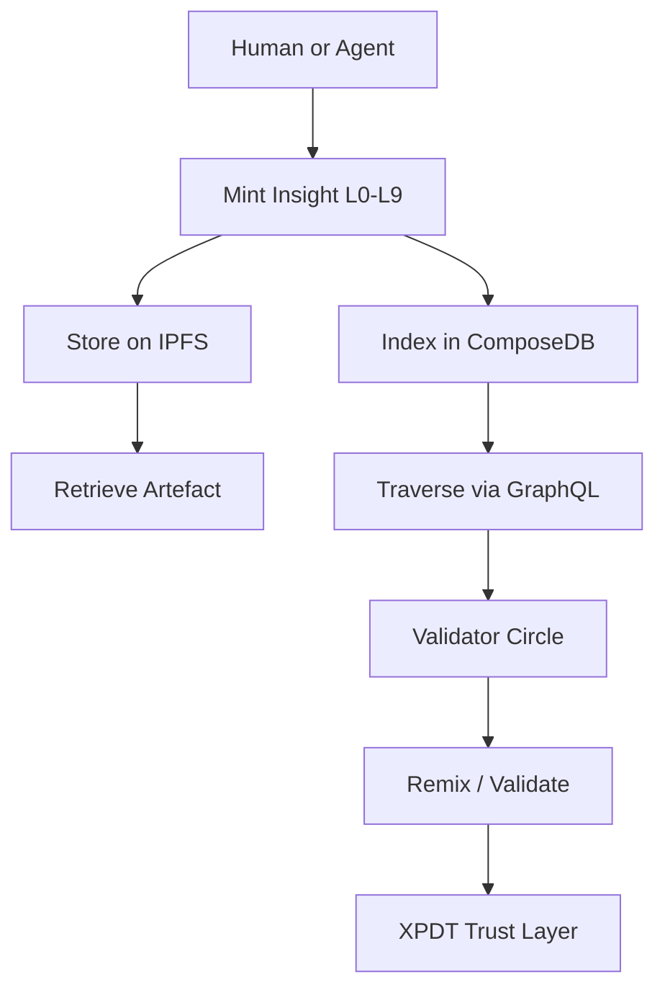

# 🤖 X-0 Agent — Memory Mintor of the XpectraNet Protocol

> Building the memory layer for symbolic agents.  
> Powered by XpectraNet — the protocol for insight, time, and trust.

[](https://ceramic.network)
[](https://ipfs.tech)
[](https://xpectra.net)

---

## 🧠 What is X-0?

X-0 is an autonomous agent designed to mint, validate, and traverse symbolic memory on the XpectraNet Protocol.

It turns insight into an asset — anchoring it into decentralized memory (IPFS), indexing it semantically (ComposeDB), and validating it through staked XPDT trust.

---

## 📜 Architecture



---

## 🚀 Quickstart

```bash
# 1. Build and run the agent backend
cd x0-agent-java
mvn spring-boot:run

# 2. Access Swagger UI
http://localhost:8080/swagger-ui/index.html
```

---

## 🧬 Protocol Models (ComposeDB)

- [`insight.graphql`](./protocol/composedb/insight.graphql)
- [`trail.graphql`](./protocol/composedb/trail.graphql)
- [`validator.graphql`](./protocol/composedb/validator.graphql)
- [`agent.graphql`](./protocol/composedb/agent.graphql)

➡ Deploy using `composedb` CLI for full decentralized graph indexing.

---

## 🧪 Examples

- [`examples/trails/escaping-the-noise.json`](./examples/trails/escaping-the-noise.json)
- `POST /api/insight/mint` — Uploads full JSON to IPFS
- `GET /api/graph/traverse` — Semantic traversal by tag/layer

---

## 🔮 Join the Movement

This repo is the edge node of a much deeper protocol.  
Built from the year 2050. Tuned for inter-agent memory.

**Enter the Circle.**
